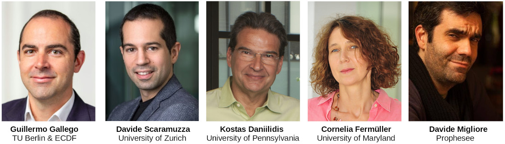

**June 19, 2021, Saturday. 1st day of CVPR**. Virtual workshop.  
Starts at **10 am [Eastern Time](https://time.is/ET)**;  4 pm [Europe Time](https://time.is/CET).  
Held in conjunction with the [IEEE Conference on Computer Vision and Pattern Recognition](http://cvpr2021.thecvf.com/) 2021.

<b>Welcome to the Third International Workshop on Event-Based Vision!</b>  

## Invited Speakers

## Schedule 

<table style="width: 100%">
  <colgroup>
    <col span="1" style="width: 8%;">
    <col span="1" style="width: 35%;">
    <col span="1" style="width: 57%;">
  </colgroup>
  <thead>
    <tr>
      <th>Time EST</th>
      <th>Speaker</th>
      <th>Title</th>
    </tr>  
  </thead>
  <tbody>
    <tr>
      <td>10:00</td>
      <td></td>
      <td>Workshop opening</td>
    </tr>
    <tr>
      <td>10:10</td>
      <td><a href="https://mirm-pitt.net/our-people/faculty-staff-bios/ryad-benosman-phd/">Ryad Benosman</a>
       (University of Pittsburgh, CMU, Sorbonne)</td>
      <td>Event Computer Vision 10 years Assessment: Where We Came From, Where We Are and Where We Are Heading To</td>
    </tr>
    <tr>
      <td>10:20</td>
      <td><a href="https://www.westernsydney.edu.au/marcs/our_team/researchers/gregory_cohen">Gregory Cohen</a>
       (Western Sydney Univ.)</td>
      <td>Neuromorphic Vision Applications: From Robotic Foosball to Tracking Space Junk, <b><a href="https://youtu.be/tiK9idp4aaY">Video</a></b></td>
    </tr>
    <tr>
      <td>10:30</td>
      <td><a href="https://cecs.anu.edu.au/people/robert-mahony">Robert Mahony</a>
         (Australian National Univ.)</td>
      <td>Fusing Frame and Event data for High Dynamic Range Video</td>
    </tr>
    <tr>
      <td>10:40</td>
      <td><a href="https://www.kynaneng.com/">Kynan Eng</a>
       (CEO of iniVation)</td>
      <td>High-Performance Neuromorphic Vision: From Core Technologies to Applications, <b><a href="https://youtu.be/E1ScHzUUeXA">Video</a></b></td>
    </tr>
    <tr>
      <td bgcolor="pink">10:50</td>
      <td bgcolor="pink"></td>
      <td bgcolor="pink"><b>Panel discussion</b></td>
    </tr>
    <tr>
      <td>11:10</td>
      <td><a href="http://www2.imse-cnm.csic.es/~bernabe/">Bernabé Linares-Barranco</a>
       (IMSE-CNM, CSIC and Univ. Seville)</td>
      <td>Event-driven convolution based processing. 
        <b><a href="https://youtu.be/JyaNT69GWO0">Video</a>, 
           <a href="https://tub-rip.github.io/eventvision2021/slides/CVPRW21_Bernabe_LinaresBarranco.pdf">Slides</a></b>
      </td>
    </tr>
    <tr>
      <td>11:20</td>
      <td><a href="http://web.stanford.edu/group/brainsinsilicon/people.html">Kwabena Boahen</a>
       (Stanford)</td>
      <td>Routing Events in Two-Dimensional Arrays with a Tree. 
        <b><a href="https://stanford.zoom.us/rec/play/T5VWnEiT3Wn9wTVsInXTwng__8M_JvKE8zEdsSHVBL6XDfJpvILxe3Bfuxva4FASxImU-N2U374lUI3V.9i_zURXctZj08yvg?continueMode=true&_x_zm_rtaid=NAtbaxIbRgKTxE1-72jTLQ.1623707710920.360b8d181286a56fbdf9a60c9b639ecb&_x_zm_rhtaid=866">Video</a>, <a href="https://tub-rip.github.io/eventvision2021/slides/CVPRW21_Kwabena_Boahen.pdf">Slides </a></b>
      </td>
    </tr>
    <tr>
      <td>11:30</td>
      <td><a href="https://engineering.jhu.edu/csms/team/rec/">Ralph Etienne-Cummings</a>
       (Johns Hopkins Univ.)</td>
      <td>Learning Spatiotemporal Filters to Track Event-Based Visual Saliency. 
        <b><a href="https://youtu.be/rSc8tvdjlhQ">Video</a>, 
           <a href="https://tub-rip.github.io/eventvision2021/slides/CVPRW21_Ralph_Etienne-Cummings.pdf">Slides</a></b>
      </td>
    </tr>
    <tr>
      <td>11:40</td>
      <td><a href="https://scholar.google.ch/citations?user=IZAZcr4AAAAJ&hl=en">Ignacio Alzugaray</a>
       (ETH Zurich)</td>
      <td>Towards Asynchronous SLAM with Event Cameras,
        <b><a href="https://youtu.be/mzwWI3DjMXI">Video</a>, 
          <a href="https://tub-rip.github.io/eventvision2021/slides/CVPRW21_Alzugaray_Chli_Lab.pdf">Slides</a></b>      
        </td>
    </tr>
    <tr>
      <td>11:50</td>
      <td></td>
      <td><b>Panel discussion</b></td>
    </tr>
    <tr>
      <td>12:10</td>
      <td>Mathias Gehrig</td>
      <td><a href="https://dsec.ifi.uzh.ch/cvprw-2021-competition/">DSEC competition</a></td>
    </tr>
    <tr>
      <td>12:20</td>
      <td></td>
      <td>Award Ceremony</td>
    </tr>
    <tr>
      <td>12:30</td>
      <td>Gatherly session</td>
      <td><b>Poster session of accepted papers and courtesy presentations</b></td>
    </tr>
    <tr>
      <td>14:00</td>
      <td><a href="https://www.intel.com/content/www/us/en/research/researchers/yulia-sandamirskaya.html">Yulia Sandamirskaya</a>
       (Intel Labs)</td>
      <td>Neuromorphic computing hardware and event based vision: a perfect match?
      </td>
    </tr>
    <tr>
      <td>14:10</td>
      <td><a href="https://abisulco.com/about.html">Anthony Bisulco, Daewon Lee, Daniel D. Lee, Volkan Isler</a>
         (Samsung AI Center NY)</td>
      <td>High Speed Perception-Action Systems with Event-Based Cameras.
        <b><a href="https://youtu.be/6ciNkcjV6EI">Video</a>, 
           <a href="https://tub-rip.github.io/eventvision2021/slides/CVPRW21_Samsung_AIC-NY.pdf">Slides</a></b>
      </td>
    </tr>
    <tr>
      <td>14:20</td>
      <td><a href="http://www.bene-guido.eu/wordpress/">Guido de Croon</a>
         (TU Delft, Netherlands)</td>
      <td>Event-based vision and processing for tiny drones
        <b><a href="https://youtu.be/GSJRszrffJI">Video</a>, 
           <a href="https://tub-rip.github.io/eventvision2021/slides/CVPRW21_Guido_de_Croon.pdf">Slides </a></b>
      </td>
    </tr>
    <tr>
      <td>14:30</td>
      <td><a href="https://www.iit.it/people/chiara-bartolozzi">Chiara Bartolozzi</a>
         (IIT, Italy)</td>
      <td>Neuromorphic vision for humanoid robots
      </td>
    </tr>
    <tr>
      <td>14:40</td>
      <td></td>
      <td><b>Panel discussion</b></td>
    </tr>
    <tr>
      <td>15:00</td>
      <td><a href="https://www.linkedin.com/in/luca-verre-71b6a75/?originalSubdomain=fr">Luca Verre</a>
         (Co-founder and CEO of Prophesee)</td>
      <td>From the lab to the real world: event-based vision evolves as a commercial force</td>
    </tr>
    <tr>
      <td>15:10</td>
      <td><a href="https://compphotolab.northwestern.edu/">Oliver Cossairt</a>
         (Northwestern Univ.)</td>
      <td>Hardware and Algorithm Co-design with Event Sensors. 
        <b><a href="https://youtu.be/0mO55e-5_qs">Video</a>, 
          <a href="https://tub-rip.github.io/eventvision2021/slides/CVPRW21_Oliver_Cossairt.pdf">Slides </a></b>
      </td>
    </tr>
    <tr>
      <td>15:20</td>
      <td><a href="https://www3.ntu.edu.sg/home/eechenss/">Shoushun Chen</a>
         (Founder of CelePixel. Will Semiconductor)</td>
      <td>Development of Event-based Sensor and Applications.
        <b><a href="https://youtu.be/5FBEqOTgxnM">Video</a>, 
           <a href="https://tub-rip.github.io/eventvision2021/slides/CVPRW21_Shoushun_Chen.pdf">Slides</a></b>
      </td>
    </tr>
    <tr>
      <td>15:30</td>
      <td><a href="https://www.linkedin.com/in/christian-br%C3%A4ndli-b1418a76/">Christian Brändli</a>
         (CEO of Sony Advanced Visual Sensing AG)</td>
      <td>Event-Based Computer Vision At Sony AVS</td>
    </tr>
    <tr>
      <td>15:40</td>
      <td></td>
      <td><b>Panel discussion</b></td>
    </tr>    
    <tr>
      <td>16:00</td>
      <td></td>
      <td>The End</td>
    </tr>
  </tbody>
</table>

<!-- Replaced by the table above

&#9632; <a href="http://www2.imse-cnm.csic.es/~bernabe/">Bernabé Linares-Barranco (IMSE-CNM, CSIC and Univ. Seville, Spain)</a> 
[Click] <b>Event-driven convolution based processing</b>. 
  <b><a href="https://youtu.be/JyaNT69GWO0">Video</a>, 
  <a href="https://tub-rip.github.io/eventvision2021/slides/CVPRW21_Bernabe_LinaresBarranco.pdf">Slides</a></b>

<b>Abstract</b>: We will review some of the event-driven hardware developments in which our lab has been involved, covering from sensitive-DVS to event-driven convolutions on dedicated ASICs, FPGAs, and the SpiNNaker platform, with applications in object recognition or stereo vision. We will show how to train event-driven convnets to minimize the number of required spikes, reducing energy consumption for the same recognition tasks. Additionally, we will present some results on a type of spike-timing-dependent-plasticity, which uses only binary weights combined with stochasticity, and which results in hardware that requires less hardware and energy resources for the same accuracy.

<b>Biography</b>: Bernabé Linares-Barranco received a first Ph.D. degree in high-frequency OTA-C oscillator design in June 1990 from the University of Seville, Spain, and a second Ph.D deegree in analog neural network design in December 1991 from Texas A&M University, College-Station, USA.
Since June 1991, he has been a Tenured Scientist at the "Instituto de Microelectrónica deSevilla". From September 1996 to August 1997, he was on sabbatical stay at the Department of Electrical and Computer Engineering of the Johns Hopkins University. During Spring 2002 he was Visiting Associate Professor at the Electrical Engineering Department of Texas A&M University, College-Station, USA. In January 2003 he was promoted to Tenured Researcher, and in January 2004 to Full Professor. Since February 2018, he is the Director of the "Insitituto de Microelectrónica de Sevilla".

He has been involved with circuit design for telecommunication circuits, VLSI emulators of biological neurons, VLSI neural based pattern recognition systems, hearing aids, precision circuit design for instrumentation equipment, VLSI transistor mismatch parameters characterization, and over the past 20 years has been deeply involved with neuromorphic spiking circuits and systems, with strong emphasis on vision and exploiting nanoscale memristive devices for learning. He is co-founder of two start-ups, Prophesee SA (www.prophesee.ai) and GrAI-Matter-Labs SAS (www.graimatterlabs.ai), both on neuromorphic hardware. He has been Associate Editor of the IEEE Transactions on Circuits and Systems Part II, IEEE Transactions on Neural Networks, and "Frontiers in Neuromorphic Engineering". Since Jan. 2021 he is Chief Editor of "Frontiers in Neuromorphic Engineering". He is an IEEE Fellow since January 2010. He is listed among the Standford top 2% most world-wide cited scientist in Electrical and Electronic Engineering (top 0.62%).

&#9632; <a href="https://engineering.jhu.edu/csms/team/rec/">Ralph Etienne-Cummings (Johns Hopkins Univ., USA)</a> 
[Click] <b>Learning Spatiotemporal Filters to Track Event-Based Visual Saliency</b>.
  <b><a href="https://youtu.be/rSc8tvdjlhQ">Video</a>, 
  <a href="https://tub-rip.github.io/eventvision2021/slides/CVPRW21_Ralph_Etienne-Cummings.pdf">Slides</a></b>

<b>Abstract</b>: Uncovering the nuances behind visual saliency, or the tendency to gaze in a particular direction or toward a specific object, is critical in understanding what and why the human mind focuses on specific features in a field of vision. There are a wide variety of applications in which saliency would provide significant steps forward, such as: tele-tourism, high-accuracy drone cameras, live-data analysis for traffic, and criminal investigations. More specifically, visual saliency in the form of event-based information is particularly attractive because event-based data encodes information in a more compressed and power efficient manner. In this workshop, we discuss an unsupervised learning scheme to learn spatiotemporal filters that can identify and track salient features in an event-based data stream. We show how decision trees and threshold tracking can learn interesting features that are not easily discernable by the human eye, and further compare our findings to a ground-truth human-based saliency experiment with event-based data. We compare hand-crafted versus learned filters with that of the ground-truth human-based data and stress the need for the first event-based visual saliency ground-truth dataset.
 

<b>Biography</b>: Ralph Etienne-Cummings, an IEEE Fellow, received his B. Sc. in physics, 1988, from Lincoln University, Pennsylvania.  He completed his M.S.E.E ('91). and Ph.D. ('94) in electrical engineering at the University of Pennsylvania.  Currently, Dr. Etienne-Cummings is a Professor and previous (7/2014 – 7/2020) Chairman of Department of Electrical and Computer Engineering at Johns Hopkins University (JHU).  He was the founding Director of the Institute of Neuromorphic Engineering. He has served as Chairman of various IEEE Circuits and Systems (CAS) Technical Committees and was elected as a member of CAS Board of Governors.  He also serves on numerous editorial boards and was recently appointed Deputy Editor in Chief for the IEEE Transactions on Biomedical Circuits and Systems.  He is the recipient of the NSF’s Career and Office of Naval Research Young Investigator Program Awards, among many other recognitions.  He was a Visiting African Fellow at U. Cape Town, Fulbright Fellowship Grantee, Eminent Visiting Scholar at U. Western Sydney and has also won numerous publication awards, most recently the 2012 Most Outstanding Paper of the IEEE Transaction on Neural Systems and Rehabilitation Engineering.  He was also recognized as a "ScienceMaker", an African American history archive and for the "Indispensable Roles of African Americans at JHU" exhibit. He has published over 250 peer reviewed article, 11 books/chapters and holds 20 patents/applications on his work.

&#9632; <a href="https://mirm-pitt.net/our-people/faculty-staff-bios/ryad-benosman-phd/">Ryad Benosman (University of Pittsburgh / Carnegie Mellon Univeristy / Sorbonne)</a> 
[Click] <b>Event Computer Vision 10 years Assessment: Where We Came From, Where We Are and Where We Are Heading To</b>.

<b>Abstract</b>: The field of Event-based vision has started within the neuromorphic community decades ago with the promise to develop a new paradigm for sensing and computation inspired by brain structures. For decades, this endeavor has been an exercise in pure research, but over the past 10 years my lab and other investigators have been pursuing this approach to build practical vision systems available to laymen that could be bought off-the-shelf and used by all. Event-based sensors introduce a radical change in Computer Vision because they sample the visual information asynchronously based on pixels “deciding” when information must be acquired. Although some Event cameras allows the acquisition of frames or absolute illuminance, I will shine light on the generic approach required to process visual events in order to make full use of the low power low latency properties of these sensors. I will explain what the canonical structure of an event-based visual application. I will finally explain based on a deep knowledge of the field and the market where all this is heading and what major achievements are waiting to be made and what is currently preventing them from happening.

&#9632; <a href="http://web.stanford.edu/group/brainsinsilicon/people.html">Kwabena Boahen (Stanford, USA)</a> 
[Click] <b>Routing Events in Two-Dimensional Arrays with a Tree</b>.
  <b><a href="https://stanford.zoom.us/rec/play/T5VWnEiT3Wn9wTVsInXTwng__8M_JvKE8zEdsSHVBL6XDfJpvILxe3Bfuxva4FASxImU-N2U374lUI3V.9i_zURXctZj08yvg?continueMode=true&_x_zm_rtaid=NAtbaxIbRgKTxE1-72jTLQ.1623707710920.360b8d181286a56fbdf9a60c9b639ecb&_x_zm_rhtaid=866">Video</a>, <a href="https://tub-rip.github.io/eventvision2021/slides/CVPRW21_Kwabena_Boahen.pdf">Slides </a></b>

<b>Abstract</b>: These days, imagers are built by stacking two chips, one with photodetectors, the other with readout electronics. A through-silicon-via or flip-chip bond-pad delivers each signal from the two-dimensional (2D) array of pixels. This approach abandons feeding pixel signals to interface circuitry on the p periphery with one or two shared wires per row or column. Instead, pixels signals may be fed to the leaves of a tree, whose nodes are distributed throughout the readout chip. We present such a tree router, tailored to 2D arrays of pixels, or of small clusters of silicon neurons; each of its nodes has four daughters. Layout is fractal (H-tree); this uses less wiring per signal than a grid. Signaling is  serial; this keeps link-width constant (regardless of payload size). To route from the tree's leaves to its root (or vise versa), each node prepends (consumes) a delay-insensitive 1-of-4 code that signals the route's previous (next) branch; additional codes carry payload (2 bits each). We deploy this serial H-tree router to service a 16×16 array of silicon-neuron clusters, each with 16 spike-generating analog somas, 4 spike-consuming analog synapses, and one 128-bit SRAM. Fabricated in a 28-nm CMOS process, the router communicates 26.8M soma-generated and 18.3M synapse-targeted spikes per second while occupying 43% of the client's 35.1×36.1sq-μm.

<b>Biography</b>: Kwabena Boahen received the B.S. and M.S.E. degrees in electrical and computer engineering from the Johns Hopkins University, Baltimore, MD, both in 1989, and the Ph.D. degree in computation and neural systems from the California Institute of Technology, Pasadena, in 1997. He was on the bioengineering faculty of the University of Pennsylvania from 1997 to 2005, where he held the first Skirkanich Term Junior Chair. He is presently Professor of Bioengineering and Electrical Engineering at Stanford University, with a courtesy appointment in Computer Science. He is also an investigator in Stanford’s Bio-X Institute and Wu Tsai Neurosciences Institute. He  founded and directs Stanford’s Brains in Silicon lab, which develops silicon integrated circuits that emulate the way neurons compute and computational models that link neuronal biophysics to cognitive behavior. This interdisciplinary research bridges neurobiology and medicine with electronics and computer science, bringing together these seemingly disparate fields. His scholarship is widely recognized, with over a hundred publications, including a cover story in Scientific American featuring his lab’s work on a silicon retina and a silicon tectum that “wire together” automatically (May 2005). He has been invited to give over a hundred seminar, plenary, and keynote talks, including a 2007 TED talk, “A computer that works like the brain”, with over seven hundred thousand views. He has received several distinguished honors, including a Packard Fellowship for Science and Engineering (1999) and a National Institutes of Health Director’s Pioneer Award (2006). He was elected a fellow of the American Institute for Medical and Biological Engineering (2016) and of the Institute of Electrical and Electronic Engineers (2016) in recognition of his lab’s work on Neurogrid, an iPad-size platform that emulates the cerebral cortex in biophysical detail and at functional scale, a combination that hitherto required a supercomputer. In his lab’s most recent research effort, the Brainstorm Project, he led a multi-university, multi-investigator team to co-design hardware and software that makes neuromorphic computing easier to apply. A spin-out from his Stanford lab, Femtosense Inc (2018), is commercializing this breakthrough.

&#9632; <a href="https://compphotolab.northwestern.edu/">Oliver Cossairt (Northwestern Univ., USA)</a> 
[Click] <b>Hardware and Algorithm Co-design with Event Sensors</b>.
    <b><a href="https://youtu.be/0mO55e-5_qs">Video</a>, 
  <a href="https://tub-rip.github.io/eventvision2021/slides/CVPRW21_Oliver_Cossairt.pdf">Slides </a></b>

<b>Abstract</b>: In this talk I will provide an overview of our research developing hardware/software co-designs with event sensors, focusing on methods to fuse together information acquired from multiple sensing modalities for task-specific processing such as image reconstruction, object detection, and tracking. I will discuss three main thrusts of research, 1) extracting 3D information from event data using structured light, and inverse rendering, 2), fusing event sensor data together with conventional frame-based camera images, and 3) a feedback-driven, chip-host architecture built for lightweight on-camera processing equipped with novel data compression algorithms for high-bandwidth, task-specific chip/host communication. Finally, I will wrap up by briefly discussing our current work in-progress developing spiking-based neural network (SNN) algorithms to leverage similar co-design principles.

<b>Biography</b>: Oliver Cossairt is Associate Professor in the Computer Science (CS) and Electrical and Computer Engineering (ECE) departments at Northwestern University. Prof. Cossairt is director of the Computational Photography Laboratory (CPL) at Northwestern University (compphotolab.northwestern.edu), whose research consists of a diverse portfolio, ranging in topics from optics/photonics, computer graphics, computer vision, machine learning and image processing. The general goal of CPL is to develop imaging hardware and algorithms that can be applied across a broad range of physical scales, from nanometer to astronomical. This includes active projects on 3D nano-tomography, computational microscopy , cultural heritage imaging analysis of paintings, structured light and ToF 3D-scanning of macroscopic scenes, de-scattering through fog for remote sensing, and coded aperture imaging for astronomy. Prof. Cossairt has garnered funding from numerous corporate sponsorships (Google, Rambus, Samsung, Omron, Oculus/Facebook, Zoloz/Alibaba) and federal funding agencies (ONR, NIH, DOE, DARPA, IARPA, NSF CAREER Award).

&#9632; <a href="https://www.westernsydney.edu.au/marcs/our_team/researchers/gregory_cohen">Gregory Cohen (Western Sydney Univ., Australia)</a> 
[Click] <b>Neuromorphic Vision Applications: From Robotic Foosball to Tracking Space Junk</b>.
  <b><a href="https://youtu.be/tiK9idp4aaY">Video</a></b>

<b>Abstract</b>: Neuromorphic event-based cameras offer a different way to approach visual imaging tasks and really excel at problems in which they can leverage the unique way that the hardware works. This talk will introduce a range of applications for neuromorphic cameras ranging from tracking space junk and satellites to their applications in robotic foosball and pinball. We will demonstrate real-world results from space tracking with event-based cameras, and introduce our Astrosite mobile neuromorphic telescope observatories - built specifically to leverage the benefits of neuromorphic space imaging. We will describe some of the problems with benchmarking and comparing neuromorphic systems, and show how robotic foosball and robotic pinball machines may be a great way to demonstrate the benefits of neuromorphic systems.

<b>Biography</b>: Gregory Cohen is an Associate Professor in Neuromorphic Systems at the International Centre for Neuromorphic Systems (ICNS) at Western Sydney University and program lead for neuromorphic algorithms and space applications. Prior to returning to research from industry, he worked in several start-ups and established engineering and consulting firms including working as a consulting engineer in the field of large-scale HVAC from 2007 to 2009, as an electronic design engineer from 2009 to 2011, and as an expert consultant for Kaiser Economic Development Practice in 2012. He is a pioneer of event-based and neuromorphic sensing for space imaging applications and his research interests include unsupervised feature extraction, bio-inspired machine learning, and neuromorphic computation systems. Greg holds a BSc(Eng), MSc(Eng), and BCom(Hons) from the University of Cape Town, South Africa and a joint PhD from Western Sydney University, Sydney, Australia and the University of Pierre and Marie Curie in Paris, France.

&#9632; <a href="http://www.bene-guido.eu/wordpress/">Guido de Croon (TU Delft, Netherlands)</a> 
[Click] <b>Event-based vision and processing for tiny drones</b>.
  <b><a href="https://youtu.be/GSJRszrffJI">Video</a>, 
  <a href="https://tub-rip.github.io/eventvision2021/slides/CVPRW21_Guido_de_Croon.pdf">Slides </a></b>

<b>Abstract</b>: Event-based vision and processing hold an important promise for creating autonomous tiny drones. Both promise to be light weight and highly energy efficient, while allowing for high-speed perception and control. For tiny drones, these characteristics are essential, as they are extremely restricted in terms of size, weight and power, while at smaller scales drones become even more agile. In my talk, I will present our work on developing event-based perception and control for tiny autonomous drones. I will delve into the approach we followed for having spiking neural networks learn visual tasks such as optical flow estimation. Furthermore, I will explain our ongoing effort to integrate these networks in autonomously flying drones.

<b>Biography</b>: Guido de Croon Received his M.Sc. and Ph.D. in the field of Artificial Intelligence (AI) at Maastricht University, the Netherlands. His research interest lies with computationally efficient, bio-inspired algorithms for robot autonomy, with an emphasis on computer vision. Since 2008 he has worked on algorithms for achieving autonomous flight with small and light-weight flying robots, such as the DelFly flapping wing MAV. In 2011-2012, he was a research fellow in the Advanced Concepts Team of the European Space Agency, where he studied topics such as optical flow based control algorithms for extraterrestrial landing scenarios. After his return at TU Delft, his work has included fully autonomous flight of a 20-gram DelFly, a new theory on active distance perception with optical flow, and a swarm of tiny drones able to explore unknown environments. Currently, he is Full Professor at TU Delft and scientific lead of the Micro Air Vehicle lab (MAVLab) of Delft University of Technology.

&#9632; <a href="https://cecs.anu.edu.au/people/robert-mahony">Robert Mahony (Australian National Univ., Australia)</a> 
[Click] <b>Fusing Frame and Event data for High Dynamic Range Video</b>.

<b>Abstract</b>: Event cameras produce data that is inherently high dynamic range and high temporal resolution but is not absolute, that is the actual intensity of a pixel is not directly available. Frame based cameras generate absolute intensity images but suffer from low dynamic range and are subject to low temporal image effects such as image blur. This talk discusses stochastic filtering algorithms for fusing these data sets to generate crisp high dynamic range images.

<b>Biography</b>: Robert Mahony is a Professor in the Research School of Engineering at the Australian National University.  He received his BSc in 1989 (applied mathematics and geology) and his PhD in 1995 (systems engineering) both from the Australian National University.  He is a fellow of the IEEE. His research  interests are in non-linear systems theory with applications in robotics and computer vision. He is known for his work in aerial robotics, geometric observer design, robotic vision, and matrix subspace optimisation.

&#9632; <a href="https://www.iit.it/people/chiara-bartolozzi">Chiara Bartolozzi (IIT, Italy)</a> 
[Click] <b>Neuromorphic vision for humanoid robots</b>.

<b>Abstract</b>: Humanoid robots need to autonomously understand the world around them and be capable of planning appropriate and timely behaviour. Event-cameras can support the development of these capabilities, mostly thanks to their high temporal resolution, compressive encoding of visual data and high dynamic range. At the same time, new computational paradigms have to be devised to process the event-stream. These novel methods range from adapting “traditional” computer vision to run on events, to getting inspired from biological visual processing. In this presentation we will cover some examples of both approaches.

<b>Biography</b>: Chiara Bartolozzi is Researcher at the Italian Institute of Technology. She earned a degree in Engineering at University of Genova (Italy) and a Ph.D. in Neuroinformatics at ETH Zurich, developing analog subthreshold circuits for emulating biophysical neuronal properties onto silicon and modelling selective attention on hierarchical multi-chip systems. She is currently leading the Event-Driven Perception for Robotics group (https://edpr.iit.it/), with the aim of applying the "neuromorphic" engineering approach (https://ieeexplore.ieee.org/document/6809149) to the design of robotic platforms as enabling technology towards the design of autonomous machines.

&#9632; <a href="https://www.intel.com/content/www/us/en/research/researchers/yulia-sandamirskaya.html">Yulia Sandamirskaya (Intel Labs, Germany)</a> 
[Click] <b>Neuromorphic computing hardware and event based vision: a perfect match?</b>

<b>Abstract</b>: I will provide an overview of spiking neuronal network based architecture for processing the event-based vision (EBV) output in neuromorphic hardware, highlighting examples of EBV workloads developed in Intel’s Neuromorphic Research Community. (https://www.intel.com/content/www/us/en/research/neuromorphic-community.html)

<b>Biography</b>: Yulia Sandamirskaya leads the Application Research team of the Neuromorphic Computing Lab of Intel Labs. Her team develops spiking neuronal network based algorithms for neuromorphic hardware to demonstrate the potential of neuromorphic computing in real-world applications. Before joining Intel, Yulia led a group “Neuromorphic Cognitive Robots” in the Institute of Neuroinformatics at the University of Zurich and ETH Zurich. She was chairing EUCog—the European Society for Artificial Cognitive Systems and coordinated an EU project NEUROTECH, creating and supporting the neuromorphic computing technology community in Europe.

&#9632; <a href="https://scholar.google.ch/citations?user=IZAZcr4AAAAJ&hl=en">Ignacio Alzugaray (V4RL, ETH Zurich, Switzerland)</a> 
[Click] <b>Towards Asynchronous SLAM with Event Cameras</b>.
  <b><a href="https://youtu.be/mzwWI3DjMXI">Video</a>, 
  <a href="https://tub-rip.github.io/eventvision2021/slides/CVPRW21_Alzugaray_Chli_Lab.pdf">Slides</a></b>

<b>Abstract</b>: Event cameras present unique characteristics that make them especially suitable for robust robotic perception such as high temporal resolution, high dynamic range and low power consumption. These sensors, however, produce an asynchronous and sparse stream of events, making the direct application of traditional computer vision algorithms originally designed for frame-based cameras unfeasible. In this talk we will present an overview of the works developed at the Vision for Robotics Lab which are directed towards the development of an efficient and event-driven pipeline for visual SLAM that can fully exploit the asynchronicity and sparsity of the event stream.

  

<b>Biography</b>: Ignacio Alzugaray is a researcher at ETH Zurich and currently pursuing a PhD in the Vision For Robotics Lab led by Margarita Chli. He obtained a Bacherlor's Degree on Industrial Technologies Engineering at the University of Malaga (2014) and a Master's Degree on Automatic Control and Robotics at the Polytechnic University of Catalonia (2016). His current research is focused on exploring novel event-driven algorithms for visual SLAM in robotic applications.

&#9632; <a href="https://www.kynaneng.com/">Kynan Eng (CEO of iniVation, Switzerland)</a> 
[Click] <b>High-Performance Neuromorphic Vision: From Core Technologies to Applications</b>.
    <b><a href="https://youtu.be/E1ScHzUUeXA">Video</a></b>

<b>Abstract</b>: Neuromorphic event-based vision can enable new levels of enhanced vision sensing in situations where current technologies fail. In this presentation, we provide an overview of our technology, our DV open developer environment, and some real-world application examples.

<b>Biography</b>: Kynan Eng is co-founder and CEO at iniVation. Prior to co-founding iniVation, he was PI of a research group at the Institute of Neuroinformatics at the University of Zurich and ETH Zurich. He also worked in the past at ABB and Alstom. He holds a PhD from the ETH Zurich, and degrees in computer science and mechanical engineering from Monash University.

&#9632; <a href="https://www3.ntu.edu.sg/home/eechenss/">Shoushun Chen (Founder of CelePixel. Will Semiconductor, China)</a> 
[Click] <b>Development of Event-based Sensor and Applications</b>.
    <b><a href="https://youtu.be/5FBEqOTgxnM">Video</a>, 
  <a href="https://tub-rip.github.io/eventvision2021/slides/CVPRW21_Shoushun_Chen.pdf">Slides</a></b>

<b>Abstract</b>: Event cameras have demonstrated great potential to solve problems in many applications such as robotics, mobile, automotive, gaming and computer vision etc. This talk will introduce the recent development by CelePixel. We will first revisit the pixel architecture, then discuss on the limiting factors of the temporal resolution which could be applicable to other event sensors, finally we will introduce an efficient event-based HCI framework.

<b>Biography</b>: Dr. Shoushun Chen received his B.S, M.E and Ph.D degrees in 2000, 2003 and 2007, respectively. He held a postdoc research fellowship in Hong Kong University of Science and Technology for one year after graduation. From Feb 2008 to May 2009 he was a postdoc research associate at Yale University. In July 2009, he joined Nanyang Technological University as a faculty. Dr. Chen is a founder of CelePixel Technology, which is now part of Will Semiconductor.

Dr. Chen is a senior member of IEEE. He serves as a member, Chair-Elect of Sensory Systems Technical Committee, IEEE Circuits and Systems Society (CASS); Associate Editor of IEEE Sensors Journal; Program Director (Smart Sensors) of VIRTUS, IC Design Centre of Excellence; Regular reviewer for a number of international conferences and journals such as TVLSI, TCAS-I/II, TBioCAS, TPAMI, Sensors, TCSVT, etc.
 

His research interests include Smart image sensor and imaging system, remote sensing imaging system and mixed signal integrated circuits.

&#9632; <a href="https://www.linkedin.com/in/christian-br%C3%A4ndli-b1418a76/">Christian Brändli (CEO of Sony Advanced Visual Sensing AG, Switzerland)</a> 
[Click] <b>Event-Based Computer Vision At Sony AVS</b>.
      <b><a href="https://youtu.be/ZCd_OqVKAxM">Video</a>, 
  <a href="https://tub-rip.github.io/eventvision2021/slides/CVPRW21_Sony_AVS.pdf">Slides</a></b>

<b>Abstract</b>: Sony Advanced Visual Sensing is a research center of Sony Semiconductor Solutions, the world leader in image sensors. With a long history in the field, Sony AVS works on event-based vision sensors (EVS) and computer vision algorithms. First, the talk will introduce some core principles of event-based processing which have been gathered over the years. The second part of the talk will then highlight some recent applications of event-based algorithms developed at Sony AVS.

<b>Biography</b>: Christian Brändli did his PhD at ETH Zurich in the research group of EVS pioneer Prof. Tobi Delbruck at the Institute of Neuroinformatics where he contributed to early event-based vision sensors and algorithms. After his graduation he co-founded the startup Insightness which developed the first stacked event-based image sensor and benchmark-beating algorithms. After the Insightness team joined Sony in 2019 he became the CEO of Sony AVS.

&#9632; <a href="https://abisulco.com/about.html">Anthony Bisulco, Daewon Lee, Daniel D. Lee, Volkan Isler (Samsung AI Center NY, USA)</a> 
[Click] <b>High Speed Perception-Action Systems with Event-Based Cameras</b>.
  <b><a href="https://youtu.be/6ciNkcjV6EI">Video</a>, 
  <a href="https://tub-rip.github.io/eventvision2021/slides/CVPRW21_Samsung_AIC-NY.pdf">Slides</a></b>

<b>Abstract</b>: High-speed perception-action systems are important for mobile robot systems to react in dynamic environments. Event-based cameras have attractive properties for these systems such as high dynamic range, efficient energy use and low latency sensing. At Samsung’s AI Center in NY (SAIC-NY) we have been working on novel DVS-based systems and algorithms to capitalize on these properties. Our previous work in this domain includes a near-chip architecture for low-complexity pedestrian detection on bandwidth-limited networks. In this talk, we will present an overview of our most recent work where the goal is to create high speed perception-action systems for collision avoidance.

  

The introduction of robots to kitchen environments will require avoidance of incoming high-speed moving obstacles such as falling spices, liquids or sharp objects that they should avoid. Our experimental test-bed to explore these systems consists of shooting a toy-dart(22m/s) at a target located on a linear-actuator with a static event-based camera observing the motion head-on. During the dart’s flight, we developed a perception system to extract time to collision and impact location on the camera plane from the event-stream  for triggering a collision avoidance system. The entire dart flight is around 150ms, hence we also analyze the various latencies of the perception-action system and system tradeoffs for collision avoidance. As a result of this analysis, we found an initial observability latency of the dart up to 100ms, which resulted in the use of a telescopic lens to reduce this delay to 20ms. A benefit of using an event-camera in this scenario as opposed to a 60Hz frame-based imager is that the perception process can acquire ~100ms of in-focus events as opposed to one or two motion blurred frames. Inspecting our perception performance using event-data, we established our perception system to estimate time to collision within 24.73% and impact location within 18.4mm on our testing dataset. Overall, our perception system and minimal system latency allows our system to successfully avoid a fast incoming toy dart.

<b>Biography</b>: Anthony Bisulco is a researcher at the Samsung Artificial Intelligence Center New York, where he works on projects at the intersection of robotics, machine learning and neuroscience. Anthony received a Master of Engineering degree from Cornell University and a Bachelor of Science degree from Northeastern University. Anthony has performed research in a variety of fields at the European Center for Nuclear Research, Sensing, Imaging, Control, and Actuation Laboratory, Google, Massachusetts Institute of Technology Lincoln Laboratories and Brookhaven National Laboratory.

&#9632; <a href="https://www.linkedin.com/in/luca-verre-71b6a75/?originalSubdomain=fr">Luca Verre (Co-founder and CEO of Prophesee, France)</a> 
[Click] <b>From the lab to the real world: event-based vision evolves as a commercial force</b>.

<b>Abstract</b>: Neuromorphic-based vision has been a popular topic at conferences and technical discussions for many years. Thousands of man years of research have gone into innovative approaches for applying it to applications that improve safety, convenience, automation and efficiency in many aspects of our lives. Today, we are at the cusp of this truly paradigm-shifting approach becoming a commercial reality. From self-driving vehicles, to smart manufacturing and logistics, to scientific research, even space exploration as we have heard from other talks at this conference – we are at the dawn of a new era that will see broader adoption of this technology. At the heart of this movement is Event-Based Vision. By the very fact that we are all gathered for this outstanding event shows the interest and progress we have made, notably by the number of commercial entities who join me as speakers. It is a testament to the dedication of a generation of engineers and researchers in this field. The next step is building on that investment and developing a true ecosystem around the technology. This will require not just companies like Prophesee who implement the core sensors and software to deliver event-based vision as a usable technology, but also a range of software developers, system integrators, distribution partners, academic researchers, standards bodies, even governments to align behind this movement and facilitate even broader adoption.  This presentation will frame that movement against the backdrop of the vast new potential of event-based vision in areas such as industrial automation, security and surveillance, mobile, IoT, health and AR/VR.

<b>Biography</b>: Luca Verre is Co-Founder and CEO of Prophesee, the inventor of the world’s most advanced neuromorphic vision systems. Prophesee’s patented technology is inspired by human vision, giving sight back to the blind and unleashing new safety standards and autonomy to cars, robots and mobile devices.

  

Luca is a World Economic Forum Technology Pioneer. He has extensive international management experience in the industrial and electronics sectors. His experience includes project and product management, marketing and business development roles at Schneider Electric. Prior to Schneider Electric, Luca worked as a Research Assistant in Photonics at the Imperial College of London. Luca holds a MSc in Physics, Electronic and Industrial Engineering from Politecnico di Milano and Ecole Centrale and an MBA from INSEAD.

-->

### Courtesy presentations
- [Yi Zhou (HKUST)](https://sites.google.com/view/zhouyi-joey/home). [Event-based Visual Odometry: A Short Tutorial](https://youtu.be/U0ghh-7kQy8).
  <b><a href="https://youtu.be/U0ghh-7kQy8">Video</a>, 
  <a href="https://tub-rip.github.io/eventvision2021/slides/CVPRW21_Yi_Zhou_Tutorial.pdf">Slides</a></b>
- [Time Lens: Event-based Video Frame Interpolation](http://rpg.ifi.uzh.ch/docs/CVPR21_Gehrig.pdf). <b><a href="https://youtu.be/dVLyia-ezvo">Video</a>, 
  <a href="http://rpg.ifi.uzh.ch/timelens/slides.pdf">Slides</a></b>
- [Back to Event Basics: Self-Supervised Learning of Image Reconstruction for Event Cameras via Photometric Constancy](https://mavlab.tudelft.nl/ssl_e2v/). <b><a href="https://youtu.be/eiIIhY7HeQM">Video</a>, 
  <a href="https://tub-rip.github.io/eventvision2021/slides/CVPR21_BackToEventsBasics_at_CVPRW.pdf">Slides</a></b>
- [Spatiotemporal Registration for Event-based Visual Odometry](https://arxiv.org/pdf/2103.05955). <b><a href="https://youtu.be/S7ABoOMxytA">Video</a></b>
- [0-MMS: Zero-Shot Multi-Motion Segmentation With A Monocular Event Camera](https://arxiv.org/pdf/2006.06158). <b><a href="https://youtu.be/KdpZkxjp02E">Video</a></b>
- [EVPropNet: Detecting Drones By Finding Propellers For Mid-Air Landing And Following](https://youtu.be/QB0W3ZF08QE). <b><a href="https://youtu.be/QB0W3ZF08QE">Video</a></b>
  

  We also welcome courtesy presentations (short talks) of related papers that are accepted at CVPR main conference or at other conferences. 
  These presentations provide visibility to your work and help to build a community around the topics of the workshop. 
  Please contact the organizers to make arrangements to showcase your work at the workshop.

## Accepted Papers
- [v2e: From Video Frames to Realistic DVS Events](papers/2021CVPRW_V2E_From_Video_Frames_to_Realistic_DVS_Events.pdf), and [Suppl mat](papers/2021CVPRW_V2E_From_Video_Frames_to_Realistic_DVS_Events_supp.zip),  <b><a href="https://youtu.be/VzQ7b5-pLag">Video</a></b>
- [Differentiable Event Stream Simulator for Non-Rigid 3D Tracking](papers/2021CVPRW_Differentiable_Event_Stream_Simulator_for_Non-Rigid_3D_Tracking.pdf), and [Suppl mat](papers/2021CVPRW_Differentiable_Event_Stream_Simulator_for_Non-Rigid_3D_Tracking_supp.pdf)
- [Comparing Representations in Tracking for Event Camera-based SLAM](papers/2021CVPRW_Comparing_Representations_in_Tracking_for_Event_Camera-based_SLAM.pdf), 
<b><a href="https://youtu.be/O1ow7c_OlDQ">Video</a>, 
  <a href="https://tub-rip.github.io/eventvision2021/slides/CVPRW21_Comparing_Representations_in_Tracking.pdf">Slides</a></b>
- [Image Reconstruction from Neuromorphic Event Cameras using Laplacian-Prediction and Poisson Integration with Spiking and Artificial Neural Networks](papers/2021CVPRW_Image_Reconstruction_from_Neuromorphic_Event_Cameras_using_Laplacian-Prediction.pdf), <b><a href="https://youtu.be/CoocgoUhxvU">Video</a>, 
  <a href="https://tub-rip.github.io/eventvision2021/slides/CVPRW21_Image_Reconstruction_from_Laplacian_prediction.pdf">Slides</a></b>
- [Detecting Stable Keypoints from Events through Image Gradient Prediction](papers/2021CVPRW_Detecting_Stable_Keypoints_from_Events_through_Image_Gradient_Prediction.pdf)
- [EFI-Net: Video Frame Interpolation from Fusion of Events and Frames](papers/2021CVPRW_EFI-Net_Video_Frame_Interpolation_from_Fusion_of_Events_and_Frames.pdf), and [Suppl. mat](papers/2021CVPRW_EFI-Net_Video_Frame_Interpolation_from_Fusion_of_Events_and_Frames_supp.zip)
<b><a href="https://youtu.be/hrfsDOL18pw">Video</a>, 
  <a href="https://tub-rip.github.io/eventvision2021/slides/CVPRW21_EFINet.pdf">Slides</a></b>
- [DVS-OUTLAB: A Neuromorphic Event-Based Long Time Monitoring Dataset for Real-World Outdoor Scenarios](papers/2021CVPRW_DVS-OUTLAB_A_Neuromorphic_Event-Based_Long_Time_Monitoring_Dataset.pdf),  <b><a href="https://youtu.be/4wV0ejrcDo0">Video</a></b>
- [N-ROD: a Neuromorphic Dataset for Synthetic-to-Real Domain Adaptation](papers/2021CVPRW_N-ROD_A_Neuromorphic_Dataset_for_Synthetic-to-Real_Domain_Adaptation.pdf), <b><a href="https://youtu.be/IOZl8MxrfpQ">Video</a>, 
  <a href="https://tub-rip.github.io/eventvision2021/slides/CVPRW21_NROD_poster.pdf">Poster</a></b>
- [Lifting Monocular Events to 3D Human Poses](papers/2021CVPRW_Lifting_Monocular_Events_to_3D_Human_Poses.pdf)
- [A Cortically-inspired Architecture for Event-based Visual Motion Processing: From Design Principles to Real-world Applications](papers/2021CVPRW_A_Cortically-inspired_Architecture_for_Event-based_Visual_Motion_Processing.pdf), <b><a href="https://youtu.be/KyS_h8i9HpM">Video</a></b>
- [Spike timing-based unsupervised learning of orientation, disparity, and motion representations in a spiking neural network](papers/2021CVPRW_Spike_timing-based_unsupervised_learning_of_orientation_disparity_and_motion_representations.pdf), and [Suppl mat](papers/2021CVPRW_Spike_timing-based_unsupervised_learning_of_orientation_disparity_and_motion_representations_supp.pdf),  <b><a href="https://youtu.be/TL567P70L68">Video</a></b>
- [Feedback control of event cameras](papers/2021CVPRW_Feedback_control_of_event_cameras.pdf)
- [How to Calibrate Your Event Camera](papers/2021CVPRW_How_to_Calibrate_Your_Event_Camera.pdf)
- [Live Demonstration: Incremental Motion Estimation for Event-based Cameras by Dispersion Minimisation](papers/2021CVPRW_Live_Demonstration_Incremental_Motion_Estimation_for_Event-based_Cameras_by_Dispersion_Minimisation.pdf)

## Reviewer Acknowledgement
[We thank our reviewers](slides/CVPRW21_Reviewers_ack.pdf) for a thorough review process.

## Objectives

This workshop is dedicated to event-based cameras, smart cameras, and algorithms processing data from these sensors. Event-based cameras are bio-inspired sensors with the key advantages of microsecond temporal resolution, low latency, very high dynamic range, and low power consumption. Because of these advantages, event-based cameras open frontiers that are unthinkable with standard frame-based cameras (which have been the main sensing technology of the past 60 years). These revolutionary sensors enable the design of a new class of algorithms to track a baseball in the moonlight, build a flying robot with the agility of a fly, and perform structure from motion in challenging lighting conditions and at remarkable speeds. These sensors became commercially available in 2008 and are slowly being adopted in computer vision and robotics. In recent years they have received attention from large companies, e.g. the event-sensor company Prophesee collaborated with Intel and Bosch on a high spatial resolution sensor, Samsung announced mass production of a sensor to be used on hand-held devices, and they have been used in various applications on neuromorphic chips such as IBM’s TrueNorth and Intel’s Loihi. The workshop also considers novel vision sensors, such as pixel processor arrays (PPAs), that perform massively parallel processing near the image plane. Because early vision computations are carried out on-sensor, the resulting systems have high speed and low-power consumption, enabling new embedded vision applications in areas such as robotics, AR/VR, automotive, gaming, surveillance, etc. This workshop will cover the sensing hardware, as well as the processing and learning methods needed to take advantage of the above-mentioned novel cameras.

## Topics Covered
- Event-based / neuromorphic vision.
- Algorithms: visual odometry, SLAM, 3D reconstruction, optical flow estimation, image intensity reconstruction, recognition, stereo depth reconstruction, feature/object detection, tracking, calibration, sensor fusion (video synthesis, visual-inertial odometry, etc.).
- Model-based, embedded, or learning approaches.
- Event-based signal processing, representation, control, bandwidth control.
- Event-based active vision, event-based sensorimotor integration.
- Event camera datasets and/or simulators.
- Applications in: robotics (navigation, manipulation, drones...), automotive, IoT, AR/VR, space science, inspection, surveillance, crowd counting, physics, biology.
- Near-focal plane processing, such as pixel processor arrays - PPAs (e.g., SCAMP sensor).
- Biologically-inspired vision and smart cameras.
- Novel hardware (cameras, neuromorphic processors, etc.) and/or software platforms.
- New trends and challenges in event-based and/or biologically-inspired vision (SNNs, etc.).
- Event-based vision for computational photography.
- A longer list of related topics is available in the table of content of the [List of Event-based Vision Resources](https://github.com/uzh-rpg/event-based_vision_resources) 

## Organizers

- [Guillermo Gallego](http://www.guillermogallego.es), Technische Universität Berlin and Einstein Center Digital Future, Germany.
- [Davide Scaramuzza](http://rpg.ifi.uzh.ch/people_scaramuzza.html), University of Zurich, Switzerland.
- [Kostas Daniilidis](https://www.cis.upenn.edu/~kostas), University of Pennsylvania, USA. 
- [Cornelia Fermüller](http://users.umiacs.umd.edu/~fer), University of Maryland, USA.
- [Davide Migliore](https://www.linkedin.com/in/davidemigliore), [Prophesee](https://www.prophesee.ai/), France.

## FAQs
<ul>
  <li><b>What is an event camera?</b> Watch this <a href="https://youtu.be/LauQ6LWTkxM">video explanation</a>.</li>
  <li><b>What are possible applications of event cameras?</b> Check the <b><a href="https://arxiv.org/abs/1904.08405">TPAMI 2020 review paper</a></b>.
  </li>
  <li><b>Where can I buy an event camera?</b> From <a href="https://github.com/uzh-rpg/event-based_vision_resources#companies_sftwr"> Inivation, Prophesee, CelePixel, Insightness</a>.</li>
  <li><b>Are there datasets and simulators that I can play with?</b> Yes, <a href="http://rpg.ifi.uzh.ch/davis_data.html">Dataset</a>. <a href="http://rpg.ifi.uzh.ch/esim.html">Simulator</a>. <a href="https://github.com/uzh-rpg/event-based_vision_resources#datasets">More</a>.</li>
  <li><b>Is there any online course about event-based vision?</b> Yes, check this <a href="https://sites.google.com/view/guillermogallego/teaching/event-based-robot-vision"> course at TU Berlin</a>.</li>
  <li><b>What is the SCAMP sensor?</b> Read this <a href="https://personalpages.manchester.ac.uk/staff/p.dudek/scamp/">page explanation</a>.</li>
  <li><b>What are possible applications of the scamp sensor?</b> Some applications can be found <a href="https://personalpages.manchester.ac.uk/staff/p.dudek/scamp/default.htm#Applications">here</a>.</li>
  <li><b>Where can I buy a SCAMP sensor?</b> It is not commercially available. Contact Prof. <a href="https://personalpages.manchester.ac.uk/staff/p.dudek/pdudek.htm">Piotr Dudek</a>.</li>
  <li><b>Where can I find more information?</b> Check out this <a href="https://github.com/uzh-rpg/event-based_vision_resources">List of Event-based Vision Resources</a>.</li>
</ul>

## Previous Related Workshops
<ul>
  <li><a href="https://robotics.sydney.edu.au/icra-workshop/">ICRA 2020 Workshop on Sensing, Estimating and Understanding the Dynamic World. Session on Event-based camera companies iniVation and Prophesee</a>.</li>
  <li><a href="http://rpg.ifi.uzh.ch/CVPR19_event_vision_workshop.html">CVPR 2019 Second International Workshop on Event-based Vision and Smart Cameras</a>.</li>
  <li><a href="https://www.jmartel.net/irosws-home">IROS 2018 Workshop on Unconventional Sensing and Processing for Robotic Visual Perception</a>.</li>
  <li><a href="http://rpg.ifi.uzh.ch/ICRA17_event_vision_workshop.html">ICRA 2017 First International Workshop on Event-based Vision</a>.</li>
  <li><a href="http://innovative-sensing.mit.edu/">ICRA 2015 Workshop on Innovative Sensing for Robotics, with focus on Neuromorphic Sensors</a>.</li>
  <li><a href="http://www.rit.edu/kgcoe/iros15workshop/papers/IROS2015-WASRoP-Invited-04-slides.pdf">Event-Based Vision for High-Speed Robotics (slides)</a> IROS 2015, Workshop on Alternative Sensing for Robot Perception.</li>
  <li><a href="http://telluride.iniforum.ch">The Telluride Neuromorphic Cognition Engineering Workshops</a>.</li>
  <li><a href="http://capocaccia.iniforum.ch">Capo Caccia Workshops toward Cognitive Neuromorphic Engineering</a>.</li>
</ul>
