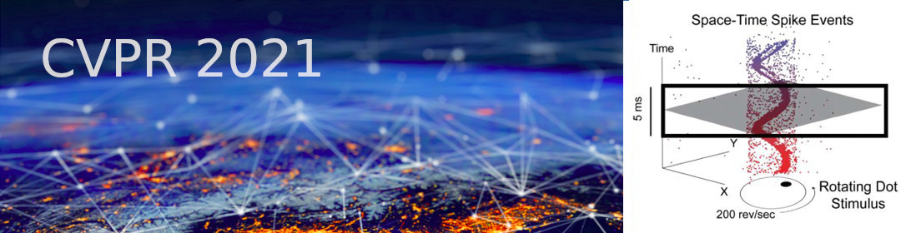

**June 19, 2021, Saturday. 1st day of CVPR**. Virtual workshop.  
Starts at **10 am [Eastern Time](https://time.is/ET)**;  4 pm [Europe Time](https://time.is/CET).  
Held in conjunction with the [IEEE Conference on Computer Vision and Pattern Recognition](http://cvpr2021.thecvf.com/) 2021.

**Welcome to the Third International Workshop on Event-Based Vision!**  

## Objectives

This workshop is dedicated to event-based cameras, smart cameras, and algorithms processing data from these sensors. Event-based cameras are bio-inspired sensors with the key advantages of microsecond temporal resolution, low latency, very high dynamic range, and low power consumption. Because of these advantages, event-based cameras open frontiers that are unthinkable with standard frame-based cameras (which have been the main sensing technology of the past 60 years). These revolutionary sensors enable the design of a new class of algorithms to track a baseball in the moonlight, build a flying robot with the agility of a fly, and perform structure from motion in challenging lighting conditions and at remarkable speeds. These sensors became commercially available in 2008 and are slowly being adopted in computer vision and robotics. In recent years they have received attention from large companies, e.g. the event-sensor company Prophesee collaborated with Intel and Bosch on a high spatial resolution sensor, Samsung announced mass production of a sensor to be used on hand-held devices, and they have been used in various applications on neuromorphic chips such as IBM’s TrueNorth and Intel’s Loihi. The workshop also considers novel vision sensors, such as pixel processor arrays (PPAs), that perform massively parallel processing near the image plane. Because early vision computations are carried out on-sensor, the resulting systems have high speed and low-power consumption, enabling new embedded vision applications in areas such as robotics, AR/VR, automotive, gaming, surveillance, etc. This workshop will cover the sensing hardware, as well as the processing and learning methods needed to take advantage of the above-mentioned novel cameras.

## Topics Covered
- Event-based / neuromorphic vision.
- Algorithms: visual odometry, SLAM, 3D reconstruction, optical flow estimation, image intensity reconstruction, recognition, stereo depth reconstruction, feature/object detection, tracking, calibration, sensor fusion (video synthesis, visual-inertial odometry, etc.).
- Model-based, embedded, or learning approaches.
- Event-based signal processing, representation, control, bandwidth control.
- Event-based active vision, event-based sensorimotor integration.
- Event camera datasets and/or simulators.
- Applications in: robotics (navigation, manipulation, drones...), automotive, IoT, AR/VR, space science, inspection, surveillance, crowd counting, physics, biology.
- Near-focal plane processing, such as pixel processor arrays - PPAs (e.g., SCAMP sensor).
- Biologically-inspired vision and smart cameras.
- Novel hardware (cameras, neuromorphic processors, etc.) and/or software platforms.
- New trends and challenges in event-based and/or biologically-inspired vision (SNNs, etc.).
- Event-based vision for computational photography.
- A longer list of related topics is available in the table of content of the [List of Event-based Vision Resources](https://github.com/uzh-rpg/event-based_vision_resources) 

<!-- ## Invited Speakers  
TBA
-->

## List of Talks and Speakers

&#9632; <a href="https://engineering.jhu.edu/csms/team/rec/">Ralph Etienne-Cummings (Johns Hopkins Univ., USA)</a> 
<b>[Expand:] Learning Spatiotemporal Filters to Track Event-Based Visual Saliency</b>, 

<b>Abstract</b>: Uncovering the nuances behind visual saliency, or the tendency to gaze in a particular direction or toward a specific object, is critical in understanding what and why the human mind focuses on specific features in a field of vision. There are a wide variety of applications in which saliency would provide significant steps forward, such as: tele-tourism, high-accuracy drone cameras, live-data analysis for traffic, and criminal investigations. More specifically, visual saliency in the form of event-based information is particularly attractive because event-based data encodes information in a more compressed and power efficient manner. In this workshop, we discuss an unsupervised learning scheme to learn spatiotemporal filters that can identify and track salient features in an event-based data stream. We show how decision trees and threshold tracking can learn interesting features that are not easily discernable by the human eye, and further compare our findings to a ground-truth human-based saliency experiment with event-based data. We compare hand-crafted versus learned filters with that of the ground-truth human-based data and stress the need for the first event-based visual saliency ground-truth dataset.
 

<b>Biography</b>: Ralph Etienne-Cummings, an IEEE Fellow, received his B. Sc. in physics, 1988, from Lincoln University, Pennsylvania.  He completed his M.S.E.E ('91). and Ph.D. ('94) in electrical engineering at the University of Pennsylvania.  Currently, Dr. Etienne-Cummings is a Professor and previous (7/2014 – 7/2020) Chairman of Department of Electrical and Computer Engineering at Johns Hopkins University (JHU).  He was the founding Director of the Institute of Neuromorphic Engineering. He has served as Chairman of various IEEE Circuits and Systems (CAS) Technical Committees and was elected as a member of CAS Board of Governors.  He also serves on numerous editorial boards and was recently appointed Deputy Editor in Chief for the IEEE Transactions on Biomedical Circuits and Systems.  He is the recipient of the NSF’s Career and Office of Naval Research Young Investigator Program Awards, among many other recognitions.  He was a Visiting African Fellow at U. Cape Town, Fulbright Fellowship Grantee, Eminent Visiting Scholar at U. Western Sydney and has also won numerous publication awards, most recently the 2012 Most Outstanding Paper of the IEEE Transaction on Neural Systems and Rehabilitation Engineering.  He was also recognized as a "ScienceMaker", an African American history archive and for the "Indispensable Roles of African Americans at JHU" exhibit. He has published over 250 peer reviewed article, 11 books/chapters and holds 20 patents/applications on his work.

&#9632; <a href="http://www2.imse-cnm.csic.es/~bernabe/">Bernabé Linares-Barranco (IMSE-CNM, CSIC and Univ. Seville, Spain)</a> 
[Expand] <b>Event-driven convolution based processing</b>.

<b>Abstract</b>: We will review some of the event-driven hardware developments in which our lab has been involved, covering from sensitive-DVS to event-driven convolutions on dedicated ASICs, FPGAs, and the SpiNNaker platform, with applications in object recognition or stereo vision. We will show how to train event-driven convnets to minimize the number of required spikes, reducing energy consumption for the same recognition tasks. Additionally, we will present some results on a type of spike-timing-dependent-plasticity, which uses only binary weights combined with stochasticity, and which results in hardware that requires less hardware and energy resources for the same accuracy.

<b>Biography</b>: Bernabé Linares-Barranco received a first Ph.D. degree in high-frequency OTA-C oscillator design in June 1990 from the University of Seville, Spain, and a second Ph.D deegree in analog neural network design in December 1991 from Texas A&M University, College-Station, USA.
Since June 1991, he has been a Tenured Scientist at the "Instituto de Microelectrónica deSevilla". From September 1996 to August 1997, he was on sabbatical stay at the Department of Electrical and Computer Engineering of the Johns Hopkins University. During Spring 2002 he was Visiting Associate Professor at the Electrical Engineering Department of Texas A&M University, College-Station, USA. In January 2003 he was promoted to Tenured Researcher, and in January 2004 to Full Professor. Since February 2018, he is the Director of the "Insitituto de Microelectrónica de Sevilla".

He has been involved with circuit design for telecommunication circuits, VLSI emulators of biological neurons, VLSI neural based pattern recognition systems, hearing aids, precision circuit design for instrumentation equipment, VLSI transistor mismatch parameters characterization, and over the past 20 years has been deeply involved with neuromorphic spiking circuits and systems, with strong emphasis on vision and exploiting nanoscale memristive devices for learning. He is co-founder of two start-ups, Prophesee SA (www.prophesee.ai) and GrAI-Matter-Labs SAS (www.graimatterlabs.ai), both on neuromorphic hardware. He has been Associate Editor of the IEEE Transactions on Circuits and Systems Part II, IEEE Transactions on Neural Networks, and "Frontiers in Neuromorphic Engineering". Since Jan. 2021 he is Chief Editor of "Frontiers in Neuromorphic Engineering". He is an IEEE Fellow since January 2010. He is listed among the Standford top 2% most world-wide cited scientist in Electrical and Electronic Engineering (top 0.62%).

&#9632; <a href="https://www3.ntu.edu.sg/home/eechenss/">Shoushun Chen (Founder of CelePixel. Will Semiconductor, China)</a> 
[Expand] <b>Development of Event-based Sensor and Applications</b>.

<b>Abstract</b>: Event cameras have demonstrated great potential to solve problems in many applications such as robotics, mobile, automotive, gaming and computer vision etc. This talk will introduce the recent development by CelePixel. We will first revisit the pixel architecture, then discuss on the limiting factors of the temporal resolution which could be applicable to other event sensors, finally we will introduce an efficient event-based HCI framework.

<b>Biography</b>: Dr. Shoushun Chen received his B.S, M.E and Ph.D degrees in 2000, 2003 and 2007, respectively. He held a postdoc research fellowship in Hong Kong University of Science and Technology for one year after graduation. From Feb 2008 to May 2009 he was a postdoc research associate at Yale University. In July 2009, he joined Nanyang Technological University as a faculty. Dr. Chen is a founder of CelePixel Technology, which is now part of Will Semiconductor.

Dr. Chen is a senior member of IEEE. He serves as a member, Chair-Elect of Sensory Systems Technical Committee, IEEE Circuits and Systems Society (CASS); Associate Editor of IEEE Sensors Journal; Program Director (Smart Sensors) of VIRTUS, IC Design Centre of Excellence; Regular reviewer for a number of international conferences and journals such as TVLSI, TCAS-I/II, TBioCAS, TPAMI, Sensors, TCSVT, etc.
 

His research interests include Smart image sensor and imaging system, remote sensing imaging system and mixed signal integrated circuits.

&#9632; <a href="https://www.linkedin.com/in/christian-br%C3%A4ndli-b1418a76/">Christian Brändli (CEO of Sony Advanced Visual Sensing AG, Switzerland)</a> 
[Expand] <b>Event-Based Computer Vision At Sony AVS</b>

<b>Abstract</b>: Sony Advanced Visual Sensing is a research center of Sony Semiconductor Solutions, the world leader in image sensors. With a long history in the field, Sony AVS works on event-based vision sensors (EVS) and computer vision algorithms. First, the talk will introduce some core principles of event-based processing which have been gathered over the years. The second part of the talk will then highlight some recent applications of event-based algorithms developed at Sony AVS.

<b>Biography</b>: Christian Brändli did his PhD at ETH Zurich in the research group of EVS pioneer Prof. Tobi Delbruck at the Institute of Neuroinformatics where he contributed to early event-based vision sensors and algorithms. After his graduation he co-founded the startup Insightness which developed the first stacked event-based image sensor and benchmark-beating algorithms. After the Insightness team joined Sony in 2019 he became the CEO of Sony AVS.

- [Ryad Benosman (Univ. Pittsburgh, USA)](https://mirm-pitt.net/our-people/faculty-staff-bios/ryad-benosman-phd/)
- [Kwabena Boahen (Stanford, USA)](http://web.stanford.edu/group/brainsinsilicon/people.html)
- [Chiara Bartolozzi (IIT, Italy)](https://www.iit.it/people/chiara-bartolozzi)
- [Oliver Cossairt (Northwestern Univ., USA)](https://compphotolab.northwestern.edu/)
- [Guido de Croon (TU Delft, Netherlands)](http://www.bene-guido.eu/wordpress/)
- [Gregory Cohen (Western Sydney Univ., Australia)](https://www.westernsydney.edu.au/marcs/our_team/researchers/gregory_cohen)
- [Yulia Sandamirskaya (Intel Labs, Germany)](https://www.linkedin.com/in/yulia-sandamirskaya-0076553/)
- [Robert Mahony (Australian National Univ., Australia)](https://cecs.anu.edu.au/people/robert-mahony)
- [Kynan Eng (CEO of iniVation, Switzerland)](https://www.kynaneng.com/)
- [Volkan Isler (Samsung AI Center NY, USA)](https://www.linkedin.com/in/volkan-isler/)
- [Luca Verre (CEO of Prophesee, France)](https://www.linkedin.com/in/luca-verre-71b6a75/?originalSubdomain=fr)

<!-- 

<b>Title</b>, by <a href="">Speaker (Affiliation)</a>

<b>Abstract</b>:
<b>Biography</b>: 

-->

## Schedule

The tentative schedule is the following:

1. Session: Neuromorphic cameras and computing.
2. Session: Event-based sensors in computer vision.
3. Session: Algorithms and Architectures.
4. Session: Industrial companies and applications.
5. Final Panel Discussion

## Accepted Papers
- [v2e: From Video Frames to Realistic DVS Events](papers/2021CVPRW_V2E_From_Video_Frames_to_Realistic_DVS_Events.pdf), and [Suppl mat](papers/2021CVPRW_V2E_From_Video_Frames_to_Realistic_DVS_Events_supp.zip)
- [Differentiable Event Stream Simulator for Non-Rigid 3D Tracking](papers/2021CVPRW_Differentiable_Event_Stream_Simulator_for_Non-Rigid_3D_Tracking.pdf), and [Suppl mat](papers/2021CVPRW_Differentiable_Event_Stream_Simulator_for_Non-Rigid_3D_Tracking_supp.pdf)
- [Comparing Representations in Tracking for Event Camera-based SLAM](papers/2021CVPRW_Comparing_Representations_in_Tracking_for_Event_Camera-based_SLAM.pdf)
- [Image Reconstruction from Neuromorphic Event Cameras using Laplacian-Prediction and Poisson Integration with Spiking and Artificial Neural Networks](papers/2021CVPRW_Image_Reconstruction_from_Neuromorphic_Event_Cameras_using_Laplacian-Prediction.pdf)
- [Detecting Stable Keypoints from Events through Image Gradient Prediction](papers/2021CVPRW_Detecting_Stable_Keypoints_from_Events_through_Image_Gradient_Prediction.pdf)
- [EFI-Net: Video Frame Interpolation from Fusion of Events and Frames](papers/2021CVPRW_EFI-Net_Video_Frame_Interpolation_from_Fusion_of_Events_and_Frames.pdf), and [Suppl. mat](papers/2021CVPRW_EFI-Net_Video_Frame_Interpolation_from_Fusion_of_Events_and_Frames_supp.zip)
- [DVS-OUTLAB: A Neuromorphic Event-Based Long Time Monitoring Dataset for Real-World Outdoor Scenarios](papers/2021CVPRW_DVS-OUTLAB_A_Neuromorphic_Event-Based_Long_Time_Monitoring_Dataset.pdf)
- [N-ROD: a Neuromorphic Dataset for Synthetic-to-Real Domain Adaptation](papers/2021CVPRW_N-ROD_A_Neuromorphic_Dataset_for_Synthetic-to-Real_Domain_Adaptation.pdf)
- [Lifting Monocular Events to 3D Human Poses](papers/2021CVPRW_Lifting_Monocular_Events_to_3D_Human_Poses.pdf)
- [A Cortically-inspired Architecture for Event-based Visual Motion Processing: From Design Principles to Real-world Applications](papers/2021CVPRW_A_Cortically-inspired_Architecture_for_Event-based_Visual_Motion_Processing.pdf)
- [Spike timing-based unsupervised learning of orientation, disparity, and motion representations in a spiking neural network](papers/2021CVPRW_Spike_timing-based_unsupervised_learning_of_orientation_disparity_and_motion_representations.pdf), and [Suppl mat](papers/2021CVPRW_Spike_timing-based_unsupervised_learning_of_orientation_disparity_and_motion_representations_supp.pdf)
- [Feedback control of event cameras](papers/2021CVPRW_Feedback_control_of_event_cameras.pdf)
- [How to Calibrate Your Event Camera](papers/2021CVPRW_How_to_Calibrate_Your_Event_Camera.pdf)
- [Live Demonstration: Incremental Motion Estimation for Event-based Cameras by Dispersion Minimisation](papers/2021CVPRW_Live_Demonstration_Incremental_Motion_Estimation_for_Event-based_Cameras_by_Dispersion_Minimisation.pdf)

### Courtesy presentations                 

  We also invite courtesy presentations (short talks) of related papers that are accepted at CVPR main conference or at other conferences. 
  These presentations provide visibility to your work and help to build a community around the topics of the workshop. 
  Please contact the organizers to make arrangements to showcase your work at the workshop.

## Organizers
- [Guillermo Gallego](http://www.guillermogallego.es), Technische Universität Berlin and Einstein Center Digital Future, Germany.
- [Davide Scaramuzza](http://rpg.ifi.uzh.ch/people_scaramuzza.html), University of Zurich, Switzerland.
- [Kostas Daniilidis](https://www.cis.upenn.edu/~kostas), University of Pennsylvania, USA. 
- [Cornelia Fermüller](http://users.umiacs.umd.edu/~fer), University of Maryland, USA.
- [Davide Migliore](https://www.linkedin.com/in/davidemigliore), Prophesee, France.

## FAQs
<ul>
  <li><b>What is an event camera?</b> Watch this <a href="https://youtu.be/LauQ6LWTkxM">video explanation</a>.</li>
  <li><b>What are possible applications of event cameras?</b> Check the <b><a href="https://arxiv.org/abs/1904.08405">TPAMI 2020 review paper</a></b>.
  </li>
  <li><b>Where can I buy an event camera?</b> From <a href="https://github.com/uzh-rpg/event-based_vision_resources#companies_sftwr"> Inivation, Prophesee, CelePixel, Insightness</a>.</li>
  <li><b>Are there datasets and simulators that I can play with?</b> Yes, <a href="http://rpg.ifi.uzh.ch/davis_data.html">Dataset</a>. <a href="http://rpg.ifi.uzh.ch/esim.html">Simulator</a>. <a href="https://github.com/uzh-rpg/event-based_vision_resources#datasets">More</a>.</li>
  <li><b>Is there any online course about event-based vision?</b> Yes, check this <a href="https://sites.google.com/view/guillermogallego/teaching/event-based-robot-vision"> course at TU Berlin</a>.</li>
  <li><b>What is the SCAMP sensor?</b> Read this <a href="https://personalpages.manchester.ac.uk/staff/p.dudek/scamp/">page explanation</a>.</li>
  <li><b>What are possible applications of the scamp sensor?</b> Some applications can be found <a href="https://personalpages.manchester.ac.uk/staff/p.dudek/scamp/default.htm#Applications">here</a>.</li>
  <li><b>Where can I buy a SCAMP sensor?</b> It is not commercially available. Contact Prof. <a href="https://personalpages.manchester.ac.uk/staff/p.dudek/pdudek.htm">Piotr Dudek</a>.</li>
  <li><b>Where can I find more information?</b> Check out this <a href="https://github.com/uzh-rpg/event-based_vision_resources">List of Event-based Vision Resources</a>.</li>
</ul>

## Previous Related Workshops
<ul>
  <li><a href="https://robotics.sydney.edu.au/icra-workshop/">ICRA 2020 Workshop on Sensing, Estimating and Understanding the Dynamic World. Session on Event-based camera companies iniVation and Prophesee</a>.</li>
  <li><a href="http://rpg.ifi.uzh.ch/CVPR19_event_vision_workshop.html">CVPR 2019 Second International Workshop on Event-based Vision and Smart Cameras</a>.</li>
  <li><a href="https://www.jmartel.net/irosws-home">IROS 2018 Workshop on Unconventional Sensing and Processing for Robotic Visual Perception</a>.</li>
  <li><a href="http://rpg.ifi.uzh.ch/ICRA17_event_vision_workshop.html">ICRA 2017 First International Workshop on Event-based Vision</a>.</li>
  <li><a href="http://innovative-sensing.mit.edu/">ICRA 2015 Workshop on Innovative Sensing for Robotics, with focus on Neuromorphic Sensors</a>.</li>
  <li><a href="http://www.rit.edu/kgcoe/iros15workshop/papers/IROS2015-WASRoP-Invited-04-slides.pdf">Event-Based Vision for High-Speed Robotics (slides)</a> IROS 2015, Workshop on Alternative Sensing for Robot Perception.</li>
  <li><a href="http://telluride.iniforum.ch">The Telluride Neuromorphic Cognition Engineering Workshops</a>.</li>
  <li><a href="http://capocaccia.iniforum.ch">Capo Caccia Workshops toward Cognitive Neuromorphic Engineering</a>.</li>
</ul>
